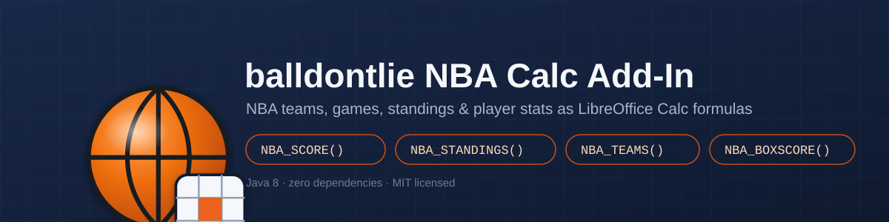

<p align="center">
  
</p>

# balldontlie NBA Calc Add-In

A LibreOffice Calc add-in (UNO component, **Java**, MIT licensed) exposing
NBA teams, games, standings, player search, and player/game statistics from
the [balldontlie](https://www.balldontlie.io/) API as worksheet functions.

| Function | Signature | Returns |
|----------|-----------|---------|
| `NBA_TEAMID`       | `NBA_TEAMID(name_or_abbrev)`                    | numeric team id |
| `NBA_TEAMS`        | `NBA_TEAMS()`                                     | spillable array: id, abbreviation, city, conference, division, full_name, name |
| `NBA_PLAYERSEARCH` | `NBA_PLAYERSEARCH(name)`                          | spillable array: id, first_name, last_name, position, team (up to 100 matches) |
| `NBA_PLAYERID`     | `NBA_PLAYERID(full_name)`                         | numeric player id (best match) |
| `NBA_GAMES`        | `NBA_GAMES(date_or_season; [team_id])`            | spillable array: date, home_team, home_score, away_team, away_score, status |
| `NBA_SCORE`        | `NBA_SCORE(season; abbrev; [nth])`                | result string, e.g. `"2024-04-10 LAL 112 - 108 BOS (W)"` |
| `NBA_STANDINGS`    | `NBA_STANDINGS(season; [conference])`             | spillable array: conference, division, team, wins, losses, win_pct, conference_rank |
| `NBA_TEAMRANK`     | `NBA_TEAMRANK(season; abbrev)`                    | numeric conference rank |
| `NBA_PLAYERSTAT`   | `NBA_PLAYERSTAT(season; id; stat_key)`            | season-average stat value |
| `NBA_BOXSCORE`     | `NBA_BOXSCORE(game_id)`                           | spillable array: player, team, min, pts, reb, ast, stl, blk, fg_pct, fg3_pct, ft_pct |
| `NBA_LASTERROR`    | `NBA_LASTERROR()`                                 | most recent fetch error message (diagnostics) |
| `NBA_CACHECLEAR`   | `NBA_CACHECLEAR()`                                | clears the cache; returns the count cleared |

> In Calc's UI, arguments are separated by **semicolons**:
> `=NBA_SCORE("2024"; "LAL")`.

---

## Cell functions never block, and never throw

Every function above resolves against a shared cache and returns
**immediately** — none of them ever block on network I/O or raise an
exception. Instead, a cell may show one of:

| Value | Meaning |
|-------|---------|
| `#LOADING` | First request for this data. A background fetch just started. Recalculate (**F9** or **Ctrl+Shift+F9**) once it completes — usually a second or two. |
| `#NO_API_KEY` | No balldontlie API key could be resolved (see below). |
| `#NOT_FOUND` | The request reached the API, but nothing matched (unknown team/abbreviation, empty player search, team not in that season's standings, etc). |
| `#ERR` | The fetch failed persistently (network error, rate limit exhausted, bad response). Call `NBA_LASTERROR()` for the detail message. An errored key is retried automatically ~15s later, so recalculating again often clears it. |

Responses are cached with a TTL appropriate to how often the underlying data
changes, and refreshed silently in the background once stale (you keep
seeing the last-known-good value while the refresh runs):

| Data | TTL |
|------|-----|
| Teams | 24 hours |
| Standings | 1 hour |
| Games / scores / box scores | 5 minutes |
| Player search | 6 hours |

The cache is a bounded, thread-safe (`ConcurrentHashMap`-backed) in-memory
store (up to 1000 entries, oldest evicted first) that lives for the life of
the LibreOffice session — call `NBA_CACHECLEAR()` to force fresh data, or
restart LibreOffice.

## Provide the balldontlie API key (never hardcoded, never in a formula)

balldontlie has required a free API key on every request since July 2026.
Get one at <https://www.balldontlie.io/>. The key is resolved, in this
priority order, and is **never** an argument in the cell formulas above:

1. **Java system property** `balldontlie.apiKey` — pass `-Dballdontlie.apiKey=...`
   when launching `soffice`.
2. **Environment variable** `BALLDONTLIE_API_KEY` — set it, then launch
   `soffice` from that same shell (or set it persistently and restart
   LibreOffice).
3. **Properties file** at `~/.config/libreoffice-nba/balldontlie.properties`:
   ```properties
   apiKey=your_key_here
   ```
   This is the most convenient option since it doesn't depend on how
   LibreOffice was launched.

If none of the three resolve, every data function returns `#NO_API_KEY`
instead of failing silently or throwing.

```bash
# Linux/macOS, environment variable route:
export BALLDONTLIE_API_KEY='your_key'
"$LO_HOME/program/soffice"

# or the properties-file route (works regardless of launch method):
mkdir -p ~/.config/libreoffice-nba
echo 'apiKey=your_key' > ~/.config/libreoffice-nba/balldontlie.properties
```

## Rate limits

The free tier is tight — measured live at **5 requests/minute**
(`x-ratelimit-limit: 5`). The add-in throttles its own outgoing requests to
match (minimum ~13s apart, across a 2-thread background pool) and retries
HTTP 429 / 5xx responses with bounded exponential backoff, honoring the
numeric `Retry-After` header balldontlie sends on a 429, before giving up
and surfacing `#ERR`. Combined with the TTL cache, normal spreadsheet use
should rarely hit the limit — but expect a fresh, uncached formula to take
up to ~13s to resolve out of `#LOADING` if you're issuing several different
requests in a row.

## Build the .oxt

```bash
export JAVA_HOME=~/jdks/jdk8u<version>   # any JDK 8+; see docs/INSTALL.md
export LO_HOME=~/libreoffice26.2         # LibreOffice + SDK
./build.sh
# or pass paths explicitly:
./build.sh --jdk ~/jdks/jdk8u<version> --libreoffice ~/libreoffice26.2
```

This runs `unoidl-write` → `javamaker` → `javac --release 8` → `jar` → zip,
producing **`build/NBA.oxt`**. See [docs/INSTALL.md](docs/INSTALL.md) for
full prerequisites (JDK 8, LibreOffice + SDK, the Java-vendor allow-list fix)
and platform-specific build/install steps (Slackware, Debian, Ubuntu,
Windows).

## Install

```bash
"$LO_HOME/program/unopkg" add --force build/NBA.oxt
```

Or double-click `build/NBA.oxt` to open the Extension Manager. Restart
LibreOffice afterwards (from a shell with the API key set, if you're using
the environment-variable route).

## Try it

```
=NBA_TEAMID("Lakers")                     -> 14  (example)
=NBA_TEAMS()                              -> spills id/abbreviation/city/... rows (array formula)
=NBA_PLAYERID("LeBron James")             -> numeric player id
=NBA_PLAYERSEARCH("James")                -> spills matching players (array formula)
=NBA_GAMES("2024-01-15")                  -> spills that day's games (array formula)
=NBA_SCORE("2024"; "LAL")                 -> "2024-04-10 LAL 112 - 108 BOS (W)"
=NBA_STANDINGS("2024"; "West")            -> spills Western Conference standings (array formula)
=NBA_TEAMRANK("2024"; "LAL")              -> numeric conference rank
=NBA_PLAYERSTAT("2024"; 237; "pts")       -> season-average points
=NBA_BOXSCORE(15908)                      -> spills that game's per-player box score (array formula)
=NBA_LASTERROR()                          -> "" (or the last failure's detail)
=NBA_CACHECLEAR()                         -> number of entries cleared
```

A ready-made example workbook is at
[`test/nba_demo.ods`](test/nba_demo.ods) — every function above, built around
the Boston Celtics (2023-24 championship season). Live results are baked in
from a real run (e.g. `NBA_SCORE("2023"; "BOS")` →
`"2024-06-17 BOS 106 - 88 DAL (W)"`, the Finals-clinching game), but since the
cache is per-session, reopening it will show `#LOADING` again until you
configure your own API key and recalculate (Ctrl+Shift+F9, a couple of times
since fetches are async). Regenerate it with `tools/build_demo.py` against a
headless LibreOffice instance.

## Behavior notes

- **Multi-cell / spilling.** LibreOffice has no dynamic spill: to see every
  row of a table-returning function, select the output range and enter it as
  an **array formula** (Ctrl+Shift+Enter, or tick **Array** in the Function
  Wizard). A plain single-cell entry shows only the top-left value.
- **`NBA_GAMES` team filter.** The optional `team_id` argument takes a
  *numeric* team id (from `NBA_TEAMID`), not an abbreviation — this avoids
  chaining two separate async lookups inside one cell call. It's honored in
  season mode; in date mode games are filtered client-side after the date
  query.
- **`NBA_SCORE` / `NBA_TEAMRANK`** each resolve the team id from the cached
  team list first. If the team list hasn't loaded yet, you'll see
  `#LOADING` once for that (it's cached 24h afterwards, so this is rare).
- **`NBA_PLAYERID` / `NBA_PLAYERSEARCH` name matching.** balldontlie's
  `search` param substring-matches a single name field, so a natural
  `"LeBron James"` query matches nothing server-side. The add-in sends only
  the last word of a multi-word query to the API (usually the most
  distinguishing token), then ranks results client-side, preferring players
  whose full name contains every word you typed. Single-word queries are
  sent as-is.
- **`NBA_PLAYERSTAT`** averages the requested `stat_key` across the player's
  games that season (simple mean — percentage fields like `fg_pct` are
  *not* attempt-weighted). `min` (minutes) is parsed from either a plain
  number or an `"MM:SS"` string.
- **No third-party jars.** HTTP uses `java.net.HttpURLConnection`; JSON is
  parsed by a small hand-rolled, tolerant parser (`Json.java`). Nothing
  beyond the JDK + UNO is bundled — avoids classloader conflicts inside the
  LibreOffice-embedded JVM.
- **`CompatibilityName`** is set for every function in `CalcAddIns.xcu`, so
  formulas survive a save-as/reopen round trip through XLS/XLSX.
- **Field-name tolerance.** balldontlie's exact JSON field names for
  standings (win percentage, conference rank) vary slightly across API
  versions; the add-in tries several common field-name spellings before
  giving up. If your account's standings response uses a different field
  name than those tried, `NBA_STANDINGS`/`NBA_TEAMRANK` may show a blank
  rank — please file an issue with the field name your response actually
  uses.
- **Paid-tier endpoints.** Confirmed live: on a free-tier key, `/standings`
  and `/stats` both return HTTP 401, so `NBA_STANDINGS`, `NBA_TEAMRANK`,
  `NBA_PLAYERSTAT`, and `NBA_BOXSCORE` will show `#ERR` (with
  `NBA_LASTERROR()` reporting `"...HTTP 401: Unauthorized"`) until you
  upgrade to a balldontlie plan that includes those endpoints.
  `NBA_TEAMID`, `NBA_TEAMS`, `NBA_PLAYERID`, `NBA_PLAYERSEARCH`,
  `NBA_GAMES`, and `NBA_SCORE` all work on the free tier.

## Changelog

See [CHANGELOG.md](CHANGELOG.md) for the release history.

## License

Released under the [MIT License](LICENSE).
